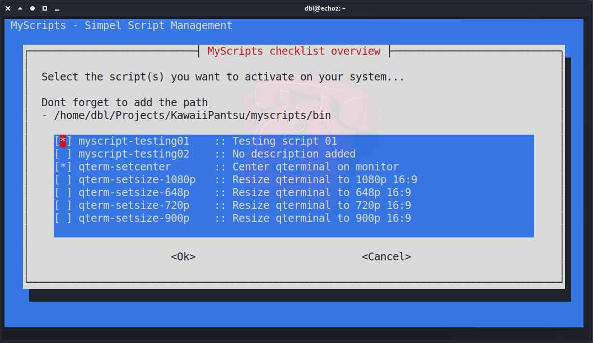
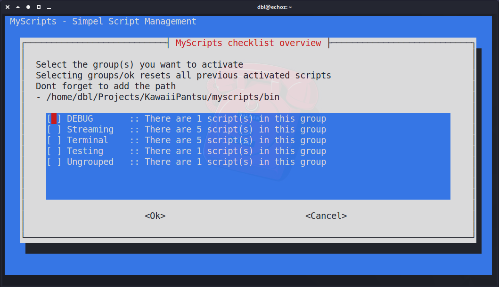

# ᵔᴥᵔ MyScripts
     
> A mishmash of scripts, in a simplistic linux script management solution

---

!! NOTE NOTE - NOT WORKING YET - Still under development :)

## Simple little script toolbox/solution for Linux environments with simplistic management

The whole idea behind it was simply to make a neat way to store/develop/manage your shell scripts. So that all my scripts i've made or found etc was in one place. But when i cloned it to a server vs workstation etc i could quicly make sure that only the scripts i wanted was active.

I'm doing the activation process just like Apache does its configs (available/enabled) Also there is man support but both via root and manpath or just locally via wrapper. This is not yet done.

## Below i show of the current state of the "simplistic management" interface.

MyScripts management system will look for 2 specific lines in your scripts and from that grab the description for individual scripts and also group name. A script can have multiple groups assosicated.

Normal individual script activation :)

Selecting scripts via groups :)