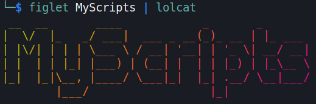

# ᵔᴥᵔ MyScripts
     
> A mishmash of scripts, in a simplistic linux script management solution

---

Simple little script toolbox for Linux with simplistic management

This is in my early todo phase ...
Still figuring out the main layout and how i want it to operate

But the whole idea is just to have a little "script platform" to manage my active scripts etc.
And to keep it all in one place and behind git revisions.

:)

